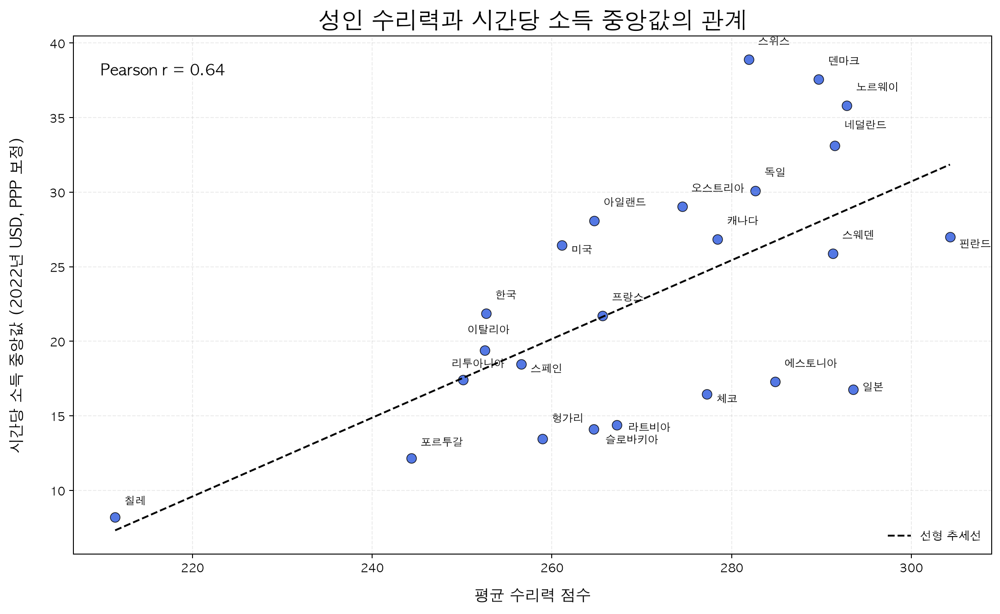
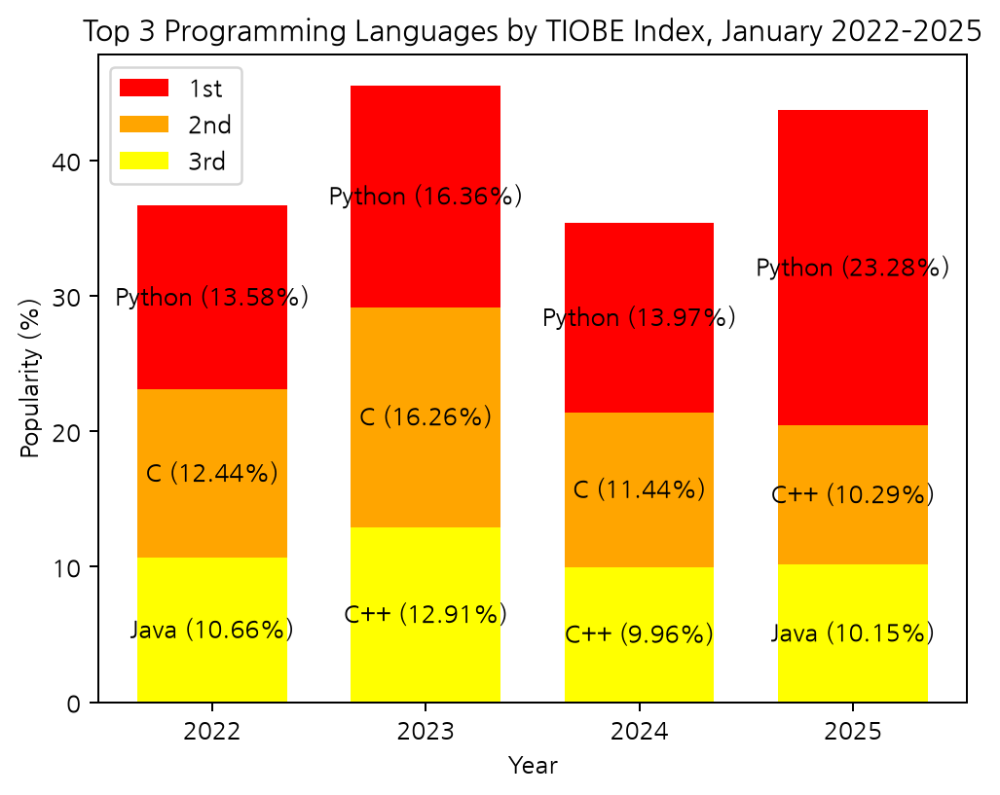

# Data Mining

Python을 이용한 데이터 마이닝 수업의 실습과 과제를 정리하는 저장소입니다. 기초 라이브러리 사용부터 실제 데이터를 읽고 시각화하는 과정까지, 코드와 결과를 함께 기록합니다.

현재는 **NumPy·Pandas 기초 실습 6개와 Matplotlib 시각화 2개**를 수록했습니다. 이후 과제는 `assignments/` 아래에 순서대로 추가할 예정입니다.

## 실습 목록

| 과제 | 주요 내용 | 사용 기술 |
| --- | --- | --- |
| [01 Python 데이터 분석 라이브러리](assignments/01-python-libraries/) | 배열과 표 자료구조, 3단 누적 막대그래프, 국가별 수리력과 소득 산점도 | Python, NumPy, Pandas, Matplotlib |

## 주요 결과

### 국가별 수리력과 시간당 소득

OECD PIAAC 자료의 24개국 평균 수리력과 시간당 소득 중앙값을 비교했습니다. 국가명을 표시하고 선형 추세선과 Pearson 상관계수를 추가했습니다.



선택한 국가들에서는 양의 상관관계가 관찰됐습니다(`r ≈ 0.6411`). 일본과 스위스처럼 수리력과 소득의 상대적인 순서가 다른 사례도 있습니다. 이는 **국가별 집계값의 관계**이며 개인의 소득이나 인과관계에 대한 결론은 아닙니다.

### 프로그래밍 언어 순위의 누적 막대그래프

2022~2025년 각 1월의 TIOBE 상위 3개 언어를 표현했습니다. `bottom`과 원소별 합을 이용해 세 구간을 누적하고, 각 구간에 언어명과 값을 붙였습니다.



색은 언어가 아닌 연도별 순위를 나타냅니다. TIOBE Rating은 인기 지표이며 실제 개발자 사용 비율이나 언어 성능을 의미하지 않습니다.

## 실행 방법

Python 3.10 이상과 가상환경 사용을 권장합니다.

```bash
git clone https://github.com/loremipsum0116/data-mining.git
cd data-mining
python3 -m venv .venv
source .venv/bin/activate
python -m pip install -r requirements.txt

# NumPy 배열 생성
python assignments/01-python-libraries/src/01_numpy_array.py

# 누적 막대그래프
python assignments/01-python-libraries/src/07_quiz_stacked_bar.py

# OECD 데이터 산점도
python assignments/01-python-libraries/src/08_matplotlib_scatter.py
```

Windows에서는 가상환경 활성화 명령 대신 `.venv\Scripts\Activate.ps1`을 사용합니다. Python 실행 명령은 설치 환경에 따라 `python` 또는 `python3`입니다.

그래프 스크립트는 결과를 해당 과제의 `figures/`에 PNG로 저장한 뒤 그래프 창을 엽니다. GUI가 없는 환경에서는 다음처럼 실행할 수 있습니다.

```bash
MPLBACKEND=Agg python assignments/01-python-libraries/src/08_matplotlib_scatter.py
```

산점도는 설치된 한글 폰트(AppleGothic, Malgun Gothic, NanumGothic, Noto Sans CJK KR)를 찾아 사용합니다. 해당 폰트가 없으면 영문 라벨을 사용합니다. CSV 경로는 스크립트 위치를 기준으로 계산하므로 현재 터미널 폴더에 의존하지 않습니다.

## 폴더 구성

```text
data-mining/
├── README.md
├── requirements.txt
└── assignments/
    └── 01-python-libraries/
        ├── README.md
        ├── src/          # 개별 실습 코드 8개
        ├── data/         # CSV와 데이터 출처 설명
        ├── figures/      # 코드로 생성한 그래프
        ├── screenshots/  # 실습 당시 실행 화면
        └── reports/      # 제출용 보고서
```

## 자료 출처

- 김봉재, 「ch04 파이썬 프로그래밍 기초」, 2026학년도 강의자료: 기초 실습 및 Quiz.
- [Matplotlib 산점도 예제](https://matplotlib.org/stable/plot_types/basic/scatter_plot.html): `ax.scatter()` 사용 방법.
- [TIOBE Index](https://www.tiobe.com/tiobe-index/): 프로그래밍 언어 인기 지표.
- [OECD PIAAC 통계표](https://stat.link/files/b263dc5d-en/smlvj6.xlsx): 수리력과 소득 데이터. 자세한 추출 위치는 [데이터 설명](assignments/01-python-libraries/data/README.md)에 기록했습니다.

강의 PDF와 수업 녹취 원문은 이 저장소에 포함하지 않습니다. 이 저장소는 수업에서 수행한 학습 기록이며, 실습 범위와 데이터의 해석 한계를 함께 기록합니다.

## Author

[`loremipsum0116`](https://github.com/loremipsum0116)
